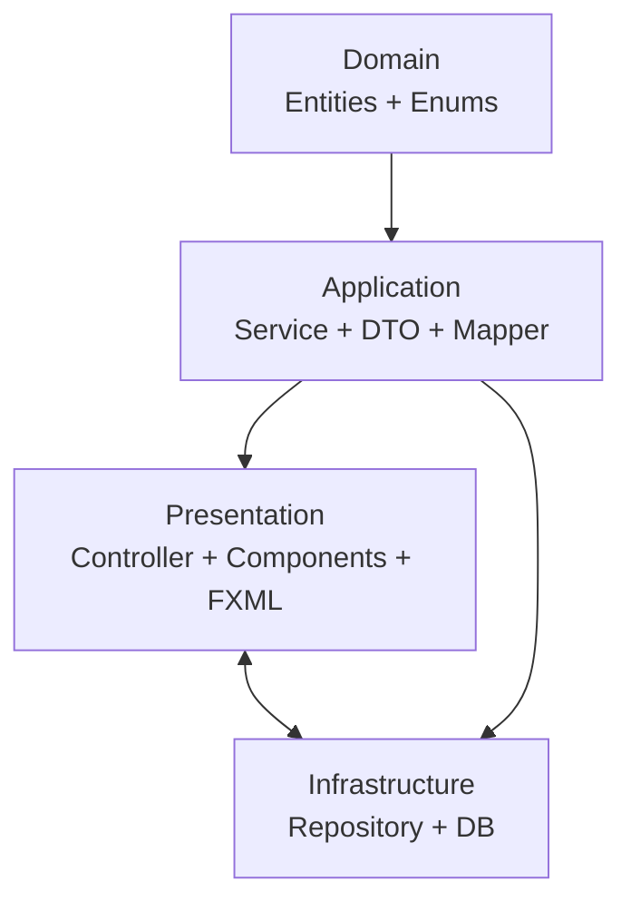

# Architecture Diagram

```mermaid
flowchart TB
    A[Domain<br/>Entities + Enums]
    B[Application<br/>Service + DTO + Mapper]
    C[Presentation<br/>Controller + Components + FXML]
    D[Infrastructure<br/>Repository + DB]

    A --> B
    B --> C
    C <--> D
    B --> D
```